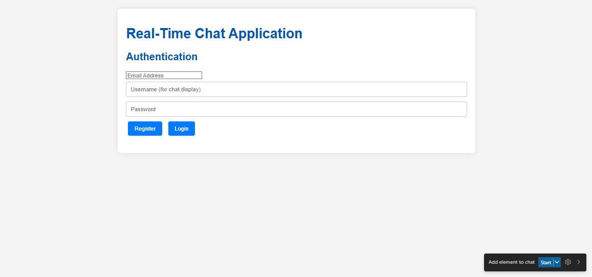

 Real-Time Chat Application

A modern, real-time chat application with WebSocket support, built with vanilla JavaScript and Node.js. Features room-based messaging, user authentication, and a responsive UI.

 

 Features

- 🔐 User Authentication - Secure registration and login with JWT tokens
- 💬 Real-time Messaging - Instant message delivery using WebSockets
- 🏠 Chat Rooms - Create and join multiple chat rooms
- 👥 User Presence - See who's online in each room
- 📱 Responsive Design - Works seamlessly on desktop and mobile devices
- 🔄 Auto-reconnect - Automatic WebSocket reconnection on connection loss

 Tech Stack

 Frontend
- HTML5/CSS3 - Modern semantic markup and styling
- Vanilla JavaScript - No framework dependencies
- WebSocket API - Real-time bidirectional communication

 Backend
- Node.js - JavaScript runtime
- Express.js - Web application framework
- WebSocket (ws) - WebSocket server implementation
- JWT - JSON Web Token authentication
- bcryptjs - Password hashing

 Project Structure

```
realtimechat.app/
├── client/                  Frontend application
│   ├── index.html          Main HTML file
│   ├── app.js             Application logic
│   ├── config.js          Configuration settings
│   ├── style.css          Styling
│   └── userData.js        User data management
├── server/                 Backend application
│   ├── index.js           Server entry point
│   ├── package.json       Dependencies
│   ├── controllers/       Request handlers
│   │   ├── authController.js
│   │   └── roomController.js
│   ├── routes/            API routes
│   │   ├── authRoutes.js
│   │   └── roomRoutes.js
│   ├── middleware/        Express middleware
│   │   └── authMiddleware.js
│   ├── utils/             Utility functions
│   │   └── websocketHandler.js
│   └── data/              In-memory data storage
│       ├── users.js
│       └── rooms.js
├── netlify/               Netlify serverless functions
│   └── functions/
└── DEPLOYMENT.md          Deployment guide
```

 Installation

 Prerequisites
- Node.js (v14 or higher)
- npm (comes with Node.js)

 Setup

1. Clone the repository
   ```bash
   git clone https://github.com/fytroy/realtimechat.app.git
   cd realtimechat.app
   ```

2. Install server dependencies
   ```bash
   cd server
   npm install
   ```

3. Configure environment (Optional)
   
   Create a `.env` file in the server directory:
   ```env
   PORT=3000
   JWT_SECRET=your_super_secret_jwt_key_here
   ```

 Running the Application

 Local Development

1. Start the server
   ```bash
   cd server
   node index.js
   ```
   
   The server will start on `http://localhost:3000`

2. Access the application
   
   Open your browser and navigate to:
   ```
   http://localhost:3000
   ```

 Client Configuration

The client configuration is managed in `client/config.js`:

- Development: Set `ENVIRONMENT: 'development'` to use `http://localhost:3000`
- Production: Set `ENVIRONMENT: 'production'` for deployed backend
- Staging: Set `ENVIRONMENT: 'staging'` for staging environment

 API Endpoints

 Authentication
- `POST /api/auth/register` - Register a new user
- `POST /api/auth/login` - Login and receive JWT token

 Rooms
- `GET /api/rooms` - Get all available rooms (requires authentication)
- `POST /api/rooms` - Create a new room (requires authentication)

 WebSocket
- `ws://localhost:3000` - WebSocket connection for real-time messaging

 Usage

1. Register an Account
   - Click "Register" on the homepage
   - Enter username and password
   - Submit to create your account

2. Login
   - Enter your credentials
   - Click "Login"

3. Create or Join a Room
   - Create a new room with a custom name
   - Or join an existing room from the list

4. Start Chatting
   - Type your message in the input field
   - Press Enter or click Send
   - Messages appear in real-time for all room participants

 WebSocket Events

 Client → Server
- `join_room` - Join a specific chat room
- `send_message` - Send a message to the current room
- `leave_room` - Leave the current room

 Server → Client
- `room_joined` - Confirmation of joining a room
- `new_message` - Receive a new message
- `user_joined` - Notification when a user joins
- `user_left` - Notification when a user leaves
- `room_users` - List of users in the current room

 Deployment

 Frontend (Netlify)
The frontend can be deployed to Netlify:
1. Connect your GitHub repository
2. Netlify auto-detects `netlify.toml` configuration
3. Deploy!

 Backend Options
- Railway - Recommended for Node.js apps
- Render - Free tier available
- Heroku - Popular platform
- Netlify Functions - Convert to serverless functions

See [DEPLOYMENT.md](DEPLOYMENT.md) for detailed deployment instructions.

 Security Notes

⚠️ Important for Production:
- Always set a strong `JWT_SECRET` environment variable
- Use HTTPS in production
- Implement rate limiting
- Add input validation and sanitization
- Current implementation uses in-memory storage (not suitable for production scale)

 Development

 Adding New Features
1. Update server controllers/routes for backend logic
2. Update client JavaScript for frontend functionality
3. Update WebSocket handlers for real-time features

 Testing
- Test WebSocket connections with multiple browser tabs
- Test authentication flow
- Test room creation and messaging
- Test reconnection logic

 Known Limitations

- In-Memory Storage: User and room data are stored in memory (resets on server restart)
- Scalability: Single server instance (consider Redis for multi-instance deployments)
- File Uploads: Not currently supported
- Private Messages: Only room-based messaging is supported

 Future Enhancements

- [ ] Database integration (MongoDB/PostgreSQL)
- [ ] Private direct messaging
- [ ] File/image sharing
- [ ] Message history persistence
- [ ] User profiles and avatars
- [ ] Typing indicators
- [ ] Message read receipts
- [ ] Emoji support
- [ ] Room permissions and moderation

 Contributing

Contributions are welcome! Please feel free to submit a Pull Request.

 License

ISC

 Author

Created by [fytroy](https://github.com/fytroy)

 Support

For issues and questions, please open an issue on the GitHub repository.
